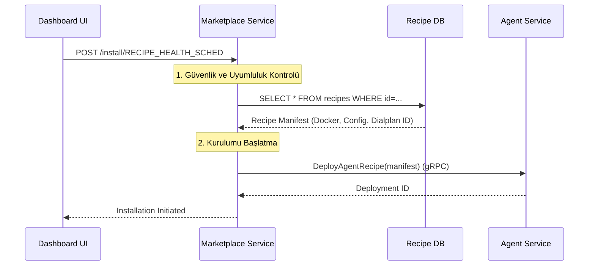

# 🛒 Sentiric Marketplace Service - Mantık ve Akış Mimarisi

**Stratejik Rol:** Sentiric platformunun Recipe (hazır Agent/Konektör şablonları) kataloğunu yöneten ve kullanıcı arayüzünden gelen kurulum taleplerini orkestra eden merkezi bileşen.

---

## 1. Temel Akış: Recipe Kurulumu (InstallRecipe)

Marketplace, Agent'ın veya Konektörün kurulması için gereken meta veriyi sağlar, ancak kurulumun kendisini Agent Service'e devreder.

## 2. Veri Kaynakları

Marketplace verileri (Recipe Listeleri, Fiyatlandırma) kendi PostgreSQL tablolarında tutulur ve sentiric-billing-service ile entegre olabilir.