# 🛒 Sentiric Marketplace Service - Mantık ve Akış Mimarisi

**Stratejik Rol:** Sentiric platformunun Recipe (hazır Agent/Konektör şablonları) kataloğunu yöneten ve kullanıcı arayüzünden gelen kurulum taleplerini orkestra eden merkezi bileşen.

---

## 1. Temel Akış: Recipe Kurulumu (InstallRecipe)

Marketplace, Agent'ın veya Konektörün kurulması için gereken meta veriyi sağlar, ancak kurulumun kendisini Agent Service'e devreder.

```mermaid
sequenceDiagram
    participant Dashboard as Dashboard UI
    participant MPS as Marketplace Service
    participant Postgres as Recipe DB
    participant AgentService as Agent Service
    
    Dashboard->>MPS: POST /install/RECIPE_HEALTH_SCHED
    
    Note over MPS: 1. Güvenlik ve Uyumluluk Kontrolü
    MPS->>Postgres: SELECT * FROM recipes WHERE id=...
    Postgres-->>MPS: Recipe Manifest (Docker, Config, Dialplan ID)
    
    Note over MPS: 2. Kurulumu Başlatma
    MPS->>AgentService: DeployAgentRecipe(manifest) (gRPC)
    AgentService-->>MPS: Deployment ID
    
    MPS-->>Dashboard: Installation Initiated
```

## 2. Veri Kaynakları

Marketplace verileri (Recipe Listeleri, Fiyatlandırma) kendi PostgreSQL tablolarında tutulur ve sentiric-billing-service ile entegre olabilir.